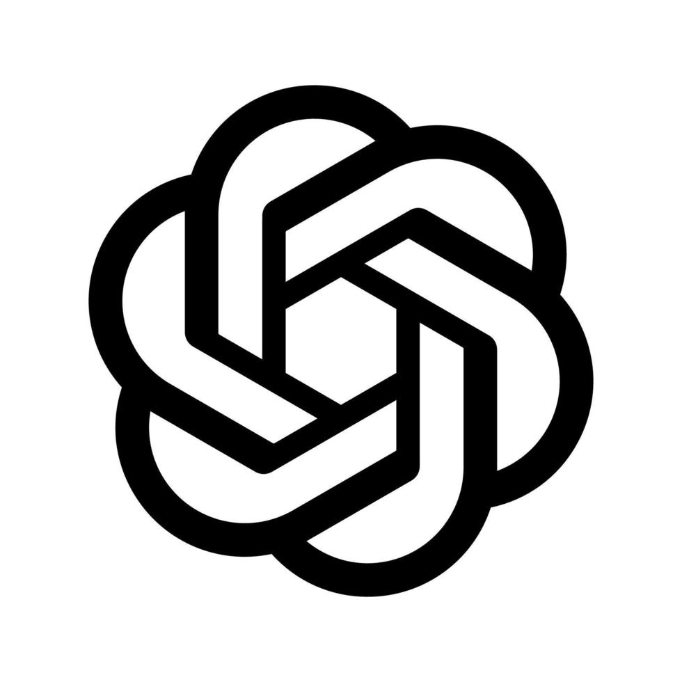

<p align="center">
  
</p>

<div align="center">

```
          _____ _______ _    _  ____  _    _
    /\   |  __ \__   __| |  | |/ __ \| |  | |
   /  \  | |__) | | |  | |__| | |  | | |  | |
  / /\ \ |  _  /  | |  |  __  | |  | | |  | |
 / ____ \| | \ \  | |  | |  | | |__| | |__| |
/_/    \_\_|  \_\ |_|  |_|  |_|\____/ \____/
```

</div>

### About

- Minecraft modder — Forge and NeoForge
- Build launchers and desktop tools for the game
- Daily setup: GNOME (Linux) and Windows 11
- <!--AGE_START-->14<!--AGE_END--> years old

### Languages & Tools

Operating systems
<p align="center">

</p>

Tools
<p align="center">

</p>

Markup
<p align="center">

</p>

Programming languages
<p align="center">

</p>

AI
<p align="center">



</p>

### Projects

- DUSMP — public multilingual Minecraft server · [site](https://www.dusmp.online) · [Discord](https://discord.gg/TeTca3wKZh)
- NEXEL — Minecraft mod suite (Forge, NeoForge), custom translation and chat · [site](https://nexel.site)

### GitHub Stats

<p align="center">


</p>

<p align="center">
  
</p>
